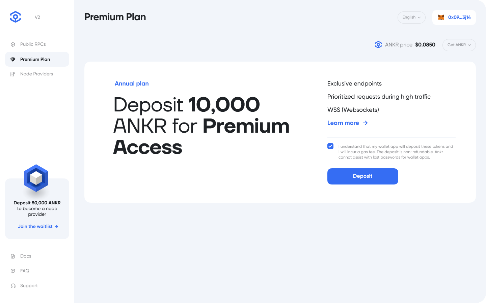

# 02 Premium Features

Ankr Pro gives you all the benefits of Public RPCs with additional exclusive features.

### Premium Plan

Deposit 10000 ANKR for 1 year.


NOTE:

Fully refundable if you change your mind within 3 days.


#### Features

1. Exclusive RPC API (https) endpoint
2. Exclusive Websocket (wss) endpoint

Enjoy the following benefits:

* At times of network congestion, Ankr Premium requests are prioritized.
* Establish a durable, low-latency connection via the websocket endpoint and have data pushed incrementally directly to you as soon as it is available. This makes it ideal for real-time data analytics


BE AWARE:

The WebSocket API limits the maximum number of simultaneous connections to provide protection against misuse e.g. DDoS attacks, for example). If your WebSocket client makes too many connections at the same time, an error message will be received.


