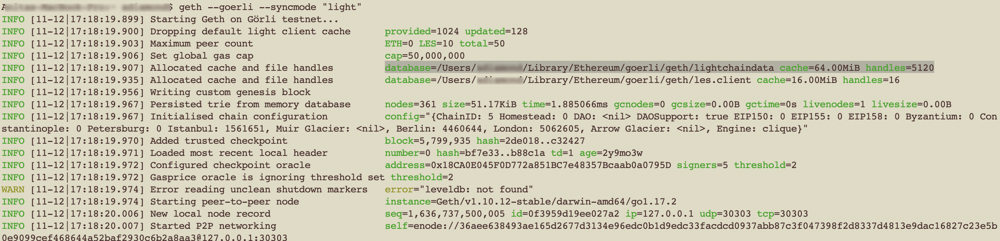

# How to run an Ethereum Node

## Introduction

This guide will walk you through setting up and launching an Ethereum Node. ** **

### **Set up Flow**

**00 Prerequisites** - Describes recommended and minimum hardware requirements.

**01 Install your preferred client software** - Select from Geth, OpenEthereum, Nethermind, Besu, Erigon&#x20;

**02 Networks and Sync mode**

**03 Run an Ethereum Test Node**

**04 Interact with Ethereum Test Node (IPC)**

**05 Connect to the Ethereum Mainnet via RPC**

## **00 Prerequisites**

**Minimum hardware requirements**

* CPU with 2+ cores
* 4 GB RAM minimum with an SSD, 8 GB+ if you have an HDD
* 8 MBit/s bandwidth

**Recommended hardware**

* Fast CPU with 4+ cores
* 16 GB+ RAM
* Fast SSD with at least 500 GB free space
* 25+ MBit/s bandwidth

## **01 Install your preferred client software**

Select from the following:

* [Geth](https://geth.ethereum.org/downloads/)\*
* [OpenEthereum,](https://github.com/openethereum/openethereum/releases),
* [Nethermind](https://downloads.nethermind.io),
* [Besu](https://pegasys.tech/solutions/hyperledger-besu/),
* [Erigon](https://github.com/ledgerwatch/erigon).

\***Geth** is one of the easiest ways to get started running a **Light Node **(A Light Node downloads all block headers, block data and verifies some randomly).&#x20;

## 02 Networks and Sync Modes


**NOTE**:&#x20;

This guide works through starting a client using **Geth**.



**Check your environment has the following:**

* [ ] Disk space requirements
* [ ] Latest OS version
* [ ] Correct system time and date&#x20;
* [ ] Router and firewall accept connections on listening ports (30303 by default)


### Networks

You can connect a **Geth** **Node** to several different networks using the network name as an argument.&#x20;

The three test networks use different consensus algorithms:

* **Mainnet: **Primary Ethereum production blockchain - actual value transactions.
* **Ropsten**: Proof-of-work test network
* **Rinkeby**: Proof-of-authority test network
* **Görli**: Proof-of-authority test network
* **Your local private network: **Not connected to a Mainnet or Testnet. [External Geth Tutorial](https://geth.ethereum.org/docs/getting-started/private-net)

### Syncmodes

Geth has three `syncmode`s.

```bash
# Downloads a local copy of every block and executes every tx ever. 
$ geth --syncmode "full"   

# Downloads all blocks and state of the last EVM 64 blocks 
$ geth --syncmode "fast"   

# Downloads all block headers, block data and verifies some randomly
$ geth --syncmode "light"  
```

## 03 Run an Ethereum Test node

Once you have decided on the **Network** and **Sync mode, **you can run your node.** **


**Be Aware**

By default Geth starts by connecting to the Ethereum Mainnet.&#x20;

You must specify the **network** and **syncmode** with flags (--)


Let's walkthrough setting up a **light testnet node (Gorli testnet**) - a great starting point.&#x20;

### 1. Run the following code:

```javascript
$ geth --goerli --syncmode "light"
```

After a few seconds you start to get output as below:


**NOTE:**

Blockchain and EVM data is stored in the location specified by **database**.&#x20;

In the example below it is: `database=/Users/username/Library/Ethereum/goerli/geth/lightchaindata cache=64.00MiB handles=5120`




Your **client **looks for a node to connect to and begins block synchronization.  The Block Count is high to start with before it catches up and displays `count = 1`


## 04 Interact with Ethereum Test Node (IPC)

You can use the built-in **Javascript console** and Javascript API **web3js** to interact with your node.&#x20;

### 1. Attach to Javascript Console

1. Search for your **IPC (Inter-process communication) endpoint** in the data.

```javascript
INFO [11-12|17:18:20.010] IPC endpoint opened  url=/Users/YOURUSERNAME/Library/Ethereum/goerli/geth.ipc
```

2\. Copy the URL path e.g.&#x20;

```javascript
/Users/YOURUSERNAME/Library/Ethereum/goerli/geth.ipc
```

3\. Open a new terminal window or tab, and run the following command:

```
$ geth attach [your IPC endpoint path]
```

4\. Successful connection is indicated by a message similar to below:

```javascript
Welcome to the Geth JavaScript console!

instance: Geth/v1.10.12-stable/darwin-amd64/go1.17.2
at block: 5837654 (Fri Nov 12 2021 17:52:11 GMT+0000 (GMT))
 datadir: /Users/YOURUSERNAME/Library/Ethereum/goerli
 modules: admin:1.0 clique:1.0 debug:1.0 eth:1.0 les:1.0 net:1.0 personal:1.0 rpc:1.0 txpool:1.0 vflux:1.0 web3:1.0

To exit, press ctrl-d or type exit
> 
```

5\. Check how many peers the client is connected to and whether you are in listening mode.

```javascript
> net.listening
true
> net.peerCount
1
> 
```

####
