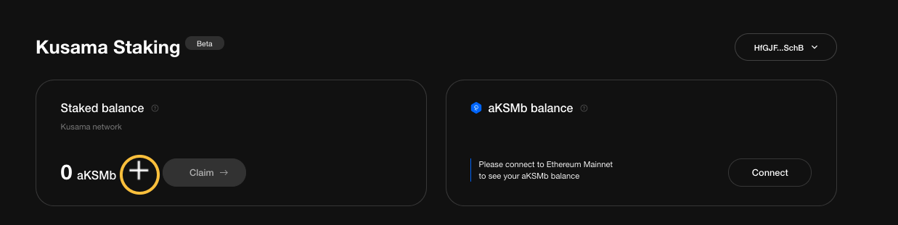
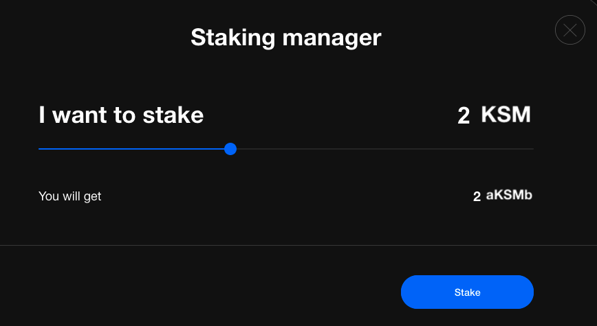

# How to stake KSM


**Checklist**

This walkthrough assumes you have:\
\- A\_**`polkadot.js`wallet**\_ installed in your Chrome Browser\
\- Sufficient **KSM** tokens for staking AND gas fees.

\
If not, check out\[ [get-started.md](get-started.md "mention")]\(../polkadot/get-started.md) for guidance.


## 01 Connect your Wallet

1\. Visit the\*\* [**\*\*StakeFi \*\***](https://stakefi.ankr.com)**app and click the '\_**StakeFi Launchpad**\_**'\*\* button.

\
2\. Locate the ‘**Stake KSM**’ box and click ‘_**Start staking**_’.

3\. Your `Polkadot.js` wallet pops up requesting 'authorization' to connect to StakeFi.\
Click to allow access.

 

### 02 Stake Desired Amount

1\. The **KSM Staking Dashboard** opens

2\. To stake, click the \*\*'+' \*\*icon.

3\. Select the desired amount to stake. **MINIMUM 1 KSM and click '**_**Stake**_\*\*' \*\*

4\. Your **Polkadot wallet** pops up requesting **authorization**. Click to authorize if you wish to proceed.

5\. The **Staking Dashboard** updates to reflect your staked amount.

### 03 Access Instant Liquidity aKSMb Tokens

1. Click '_**Connect**_' to connect to an EVM Wallet e.g. MetaMask
2. Select your **Wallet** type and connect.

3\. Authorize your Ethereum Wallet

4\. Authorize your Polkadot Wallet


**Successful access to aKSMb Tokens**

Success is indicated by your Ethereum Wallet updating with aKSMb tokens.

You are now free to utilize your aKSMb on other DeFi Platforms.


###

***
