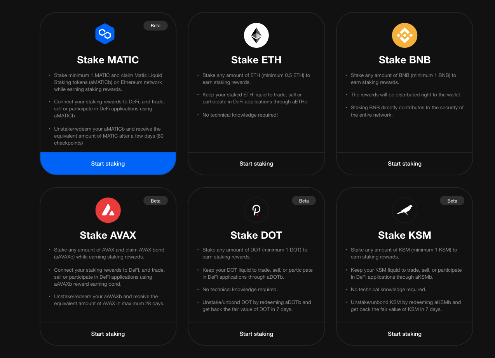

# How to unstake MATIC

### Intro

To unstake your MATIC, simply choose the '**Unstake'** option at any time on the [StakeFi](https://stakefi.ankr.com/internet-bonds) platform.&#x20;

If you decide to unstake, it can take 3-4 days before you can claim your funds. Throughout this period, your MATIC will continue to **earn staking rewards**.


**Before you start**

Ensure you have **10 ANKR** fee to unstake plus a small (variable) ETH transaction fee approximately **0.0005 ETH**.

Unstaking MATIC tokens is a multi-step process involving sending several transactions to the MATIC smart-contracts deployed in Ethereum.&#x20;

Ankr StakeFi covers the gas fee cost and charge a modest fee in Ankr to compensate its expenses. MATIC tokens are transferred to your wallet automatically when the unstaking process completes. There is no additional cost for this.&#x20;



### Unstake MATIC

1.Open [**StakeFi**](https://stakefi.ankr.com/internet-bonds) and click **StakeFi launchpad**&#x20;

2\. Locate the '**Stake MATIC**' box and click '**Start Staking**'&#x20;

3\. Click '**Grant Access**' to connect to your wallet.&#x20;

4\. Click the '**-' icon** to unstake.&#x20;

5\. Select the amount to unstake or select 'MAX' and click '_**Unstake**_'


**FEES:**

There is a **10 ANKR** fee to unstake plus a small (variable) ETH transaction fee


6\. You will need to '_**Confirm**_**'** the ANKR fee transaction in your wallet.


**Success!**

Once transaction is confirmed, the **Staking Dashboard **updates to show '_**Unbonding in progress'**_



**NOTE**

Unbonding MATIC requires 80 checkpoints and may take approximately 25 hours depending on network congestion. &#x20;


7\. Following the **unbonding** period, your MATIC balance updates in your wallet automatically.&#x20;
