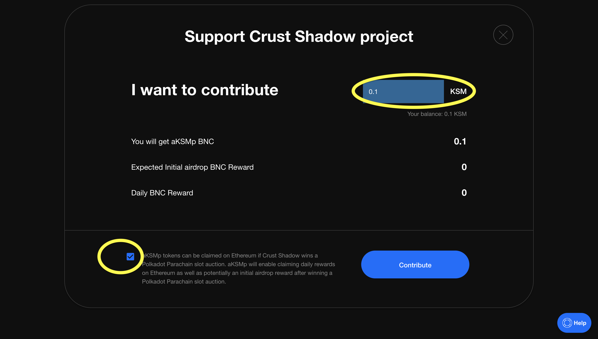

# How to participate in Kusama Slot Auctions using StakeFi

### 01 Open the Parachain Liquid Bonding App

1. Visit the [Parachain Liquid Bonding](https://stakefi.ankr.com/parachain-bonds) website and click ‘_Launch App_’\

2. Select the Kusama Network.

**3. **In this walkthrough, we select the ‘_Kusama_’ Network to open the **Parachain Crowdloan Marketplace**.

### 02 Connect your Wallet&#x20;

1 Select ‘_Connect Polkadot Wallet '_ to open the **Wallet** popup.

2\. Select '**Metamask**' and ensure it is configured to the '**Ethereum Mainnet'**. You are prompted to change the configuration if it is incorrect.


**Successful Connection**

A successful connection is indicated by the upper right hand corner displaying your_ Polkadot Wallet _address.&#x20;


3\. Select the **Project** you want to support and click _'Contribute KSM/DOT'. _\
_- _Enter the amount of KSM/DOT to contribute\
\- Check the box to confirm you understand.\
\- Click '_Contribute_'

4\. Your Polkadot wallet pops up for you to sign the transaction. Enter your password to sign the transaction.&#x20;
