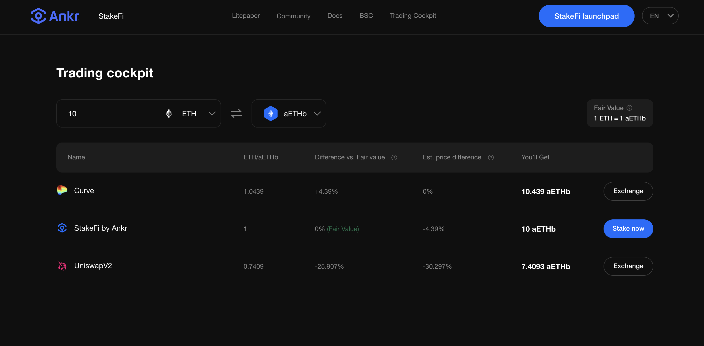

# Trade

Check out the latest development to Ankr Earn.

**Ankr Boost Trade** is a Liquid Staking data aggregation tool providing access to real-time trading prices.&#x20;


**NOTE:**&#x20;

Real-time prices are provided by OpenOcean and the OpenOcean Trading Aggregator.  The OpenOcean Trading Aggregator applies a deeply optimized intelligent routing algorithm and a transparent price mechanism.  The algorithm is designed to allow a user to place orders with lower slippage, less gas consumption and better prices.


Select an asset you wish to trade and with a click of a button, **Ankr Boost Trade** compares real-time trading prices for the chosen asset pair.&#x20;

In the following example, we want to know how much aETHb we can get for 10 ETH.&#x20;

We enter 10 and select the asset type to convert (ETH) to aETHb.

We click the double arrow to get prices at Exchanges. We can quickly assess any difference at Exchanges between Fair Value and Market Value.&#x20;

We can then click to visit the Exchange and complete our trade.&#x20;

In the example we can see that we would receive an equivalent amount of aETHb. This is because the fair value of ETH to aETHb is set as a 1:1 relationship.

### What is Redemption Value?&#x20;

The Redemption Value or Fair Value represents the ratio at which users can stake/unstake 1 token. For reward earning tokens i.e. aETHb the ratio is always 1. This is because any difference is passed to your wallet as a type of staking reward resulting from rebasing.&#x20;

The Redemption Value of aETHc is always higher than 1. This is because staking rewards accumulate and can be realized when users unstake. The Ratio or Redemption Value of aETHc is therefore continuously increasing together with ETH staking rewards.

The aETHc ratio is also applied when staking ETH to avoid existing stakers being diluted by new stakers. In other words, if the redemption value of 1 aETHc is 1.05 ETH, a new user willing to stake ETH will get 1/1.05 = 0.9524 aETHc for staking 1 ETH.

### Should I Stake or Should I Trade?

Ankr Boost Trade will compare prices on the market with Ankr's redemption (fair) value to indicate whether it is more attractive to stake, or trade. This tool was made to help stakers make better-informed decisions.&#x20;

