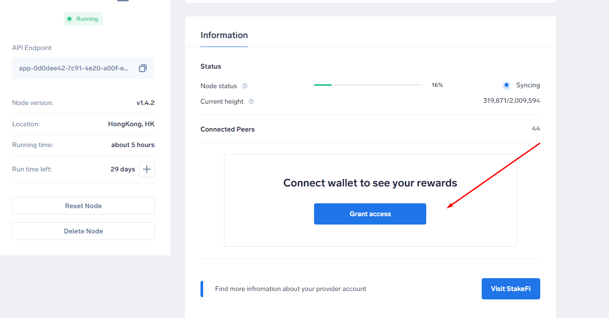

# Running Provider Nodes

### What do Providers do?

Providers play a crucial role by contributing to the secure running of the upcoming Proof-of-Stake Beacon Chain upgrade of the Ethereum network. (ETH 2.)

Providers propose, verify, and vouch for the validity of blocks in exchange for financial rewards.

#### Considerations 

As a Provider, you are responsible for your own performance. If your node hardware performs poorly and you go offline or you decide to exit your Ankr hosted node - Penalties are incurred.

The penalties for being offline are roughly equal to the rewards for actively participating. To ensure stakers can be reimbursed if a Provider goes offline, a Deposit is required to act as Insurance and guarantee your Providing services.

### Provider Requirements 

Provider requirements depend on how you provide. You can either run new Staking nodes using your own hardware or use Ankr Staking nodes.

#### :small\_orange\_diamond: OPTION 1 Running new Staking nodes 

Providers can bring CPU, GPU, memory and free storage to connect to the StakeFi infrastructure using ANKR tokens and host new Staking nodes.

Providers must meet the following minimum hardware requirements as follows:

****:white\_check\_mark: **Recommended Requirements**

| __            |                                              |
| ------------- | -------------------------------------------- |
| **Processor** | Intel Core i7–4770 or AMD FX-8310 or better  |
| **Memory**    | 16GB RAM                                     |
| **Storage**   | 100GB available space SSD                    |
| **Internet**  | Broadband connection                         |

#### :large\_orange\_diamond: Minimum Requirements

|               |                                            |
| ------------- | ------------------------------------------ |
| **OS**        | 64-bit Linux, Mac OS X, Windows            |
| **Processor** | Intel Core i5–760 or AMD FX-8100 or better |
| **Memory**    | 8GB RAM Storage: 20GB available space SSD  |
| **Internet**  | Broadband connection                       |

#### :small\_orange\_diamond: OPTION 2 Using Ankr Staking Nodes 

Providers can use Ankr staking nodes via sidecars (Ankr Node Software) running on an Ethereum 2.0 node. This way Providers DO NOT need to host staking nodes themselves.

_**Requirements**_

Providers are required to stake a minimum of 2 ETH or 25,000 ANKR per node. The 2 ETH acts as insurance to compensate users in case of slashing events. This is locked until the release of ETH 2.0.

### How do I view estimated earnings?&#x20;

To view estimated earnings on ETH 2 Provider Nodes, \
1\. Login to the [Ankr App](https://app.ankr.com)\
2\. Select 'Nodes' from the left menu and select your ETH 2 Node.\
3\. Click 'Grant access' to connect your wallet and check estimated rewards. \

\
\

