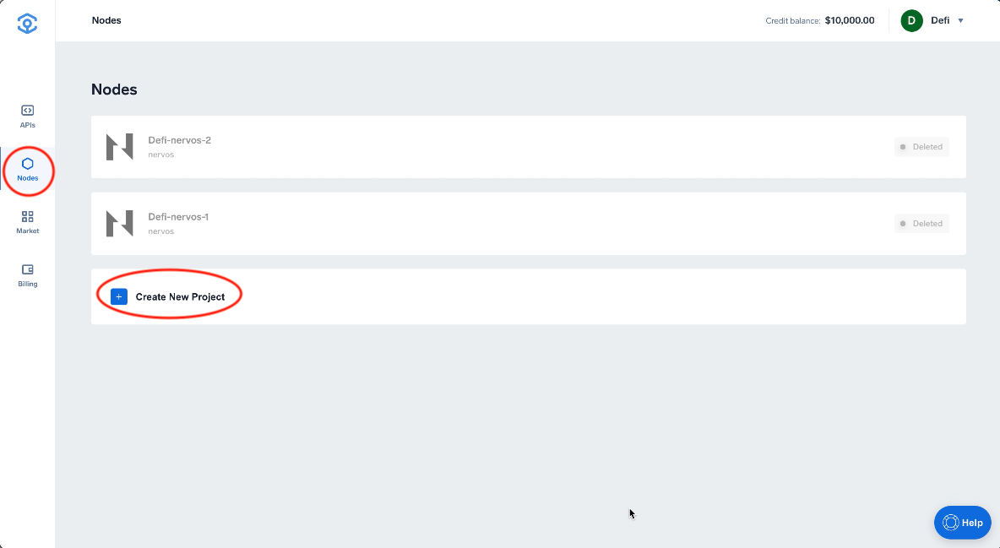

# Get Started

### STEP 1: Spin up a Nervos Node

1. Login or sign up for an account on [**app.ankr.com**](https://app.ankr.com)****
2. Select '**Nodes**'** **and** 'Create New Project' **

3\. The **'Nodes Market'** opens and the **Full Nodes** tab is displayed&#x20;

4\. Search for 'Nervos' and click '**Deploy**' to open the Deployment page.

### STEP 2: Set up your Node&#x20;

1. **Your Infrastructure** - The recommended infrastructure required is displayed by default. You can alter this by selecting the **Advanced** button. Observe the impact of any changes you make on cost per month.\

2. **Choose Server Location **- If applicable.\

3. **Configure your Node **- Assign a 'Project Name' and 'Choose a Network'. See [Choosing a Network](../../resources/articles/choosing-a-network.md) for general guidance.&#x20;

### **STEP 3: Select your Payment Method **

You can choose 'Prepayment' or 'Daily Billing'.

#### a) Prepayment

1.You can choose to prepay at least 1 month in advance using:\
\- USDT, \
\- Credit Card \
\- ANKR ERC-20 Tokens. \
\- Your Ankr account Credit Balance \
\
2\. Select 'Proceed to Payment'

3\. Click 'I agree' to confirm your selected payment method OR close the window to select an alternative.

4\. Select your desired 'Payment Method' and click 'Pay with xxxx' to deploy your node.\

#### b) **Daily Billing**

1.You can choose Daily Billing (by Credit Card only). \
\
2.Click 'Proceed to Payment'\
\
3\. You are prompted to enter your Credit Card details. Enter these and click 'Next step'\

### STEP 4: Your Node is Deployed

Once payment is completed, your node is prepared for deployment.&#x20;


**NOTE**: You can cancel deployment at this point if desired.&#x20;


#### :white\_check\_mark: Successful Node Deployment

Successful node deployment opens a dashboard view for your new node.

:information\_source: _**Node Project Information**_

| Category           | Meaning                                                                                                                            |
| ------------------ | ---------------------------------------------------------------------------------------------------------------------------------- |
| **Project Name **  | e.g. Defi-nervos-4.                                                                                                                |
| **Running Status** |  e.g.Running                                                                                                                       |
| **API Endpoint**   | Copy this to make calls to your node                                                                                               |
| **Node version**   | The version of your node.                                                                                                          |
| **Location**       | The geographical_** **_location of your node                                                                                       |
| **Running time**   | How long your node has been running                                                                                                |
| **Run time left ** | How long you have left until your payment plan expires.                                                                            |
| **Resource usage** | How much CPU, RAM and Storage is currently being used                                                                              |
| **Status**         | 
<em>Node status: </em>The percentage of the network that is synchronised.  <em>Current height: </em>Current block height
 |
| **Network**        | The network your node is on e.g. mainnet or testnet                                                                                |
| **Documentation**  | View the chain documentation                                                                                                       |

## **Next Steps**

Use the API Endpoint to interact with your node. \
View Official [Nervos CKB JSON RPC Docs](https://github.com/nervosnetwork/ckb/blob/master/rpc/README.md)
